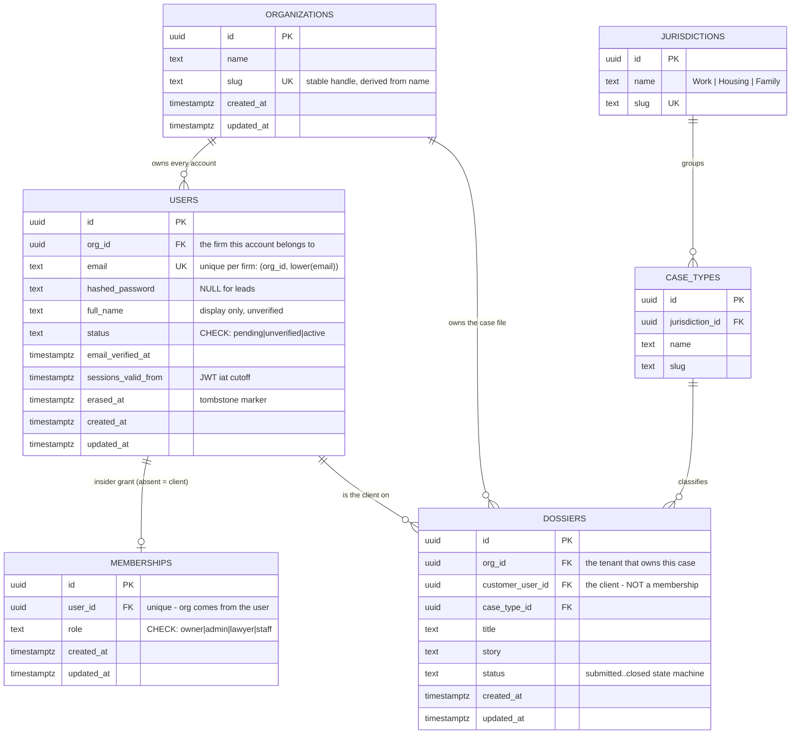

# Database schema

The whole data model in one place. **`DESIGN.md` is the authority** on *why* any of this
is shaped the way it is; this file is the map.

Renders on GitHub. Update it whenever a table lands.

## Current + planned

## Build status

| Table | State |
|-------|-------|
| `organizations` | ✅ shipped — 3 endpoints under `/api/v1` |
| `users` | ✅ shipped — no endpoints yet (auth slice is spec'd, see `auth.md`) |
| `memberships` | ⏳ designed (`models/membership.md`), not built — next after auth |
| `jurisdictions` / `case_types` | ❌ blocked on DESIGN.md §10 **Q6** (global taxonomy vs per-firm) |
| `dossiers` | ❌ blocked on `memberships` + reference data |

## The one thing to read the diagram for

**Every account belongs to one firm, and within it, insiders and outsiders are different
shapes** — not different permission levels (DESIGN.md §3):

| Who | Marked by | Scope predicate |
|-----|-----------|-----------------|
| **insider** — staff, lawyers | a `MEMBERSHIPS` row | `WHERE org_id = :org` — the firm's whole book of business |
| **outsider** — a client | **no** membership row | `WHERE org_id = :org AND customer_user_id = :me` — their own case only |

No role check can express that second predicate, which is why `customer` is **not** a role.
The same person can be a `lawyer` at a firm *and* a client of it — one membership, one
dossier, no conflict.

Since Q2 (per-firm accounts) the same human at two firms is **two unrelated `USERS` rows**.
Nothing links them, which is what keeps CasePilot a pure processor.

## Conventions visible in the diagram

- **UUID PKs everywhere** (§10 Q4). Non-enumerable, URL-safe, no int→UUID migration later.
- **`created_at` + `updated_at`, tz-aware, on every table** — from `TimestampMixin`, filled
  by the database (`server_default`) so they're right regardless of how a row is written.
- **Enum-ish columns are `text` + a CHECK constraint**, never a Postgres `ENUM` type.
  Postgres has no `ALTER TYPE ... DROP VALUE`, and these sets are still churning. The
  CHECK is generated from a Python `StrEnum` so there's one source of truth. Note
  **Alembic autogenerate cannot see CHECK changes** — those migrations are hand-written.
- **`org_id` on every table, no exceptions** (§2) — `users` included, since Q2. That
  uniformity is what makes RLS one policy shape instead of a special case.

## Deletion behaviour — not symmetric, on purpose

| Row | On "delete" |
|-----|-------------|
| `users` | **never deleted.** Erasure anonymises in place (`erased_at`); the row survives as an FK anchor for case files. |
| `memberships` | **hard `DELETE`.** An access grant, not a record. A tombstone would occupy the `user_id` unique slot and block re-adding someone who left. |
| `organizations` | **no `DELETE` endpoint at all.** Deleting a tenant would destroy `dossiers` the firm is legally obliged to keep. The real operation is *closure* — lifecycle, a future `status` value. |
| `dossiers` | legal records; retention is the firm's obligation (§2a). |

**Never `ON DELETE CASCADE` from `users` to tenant data** (§2a) — an identity-plane
erasure must not be able to destroy a firm's legal records.

## Not in the diagram yet

Deliberate omissions, each with a home elsewhere:

- **Profile** (legal name, address, phone, DOB) — per-firm *attested* data, hanging off
  `dossiers`. See `models/user.md`; the snapshot mechanics are still undesigned.
- **Anonymous chat sessions** (`user_id NULL`) and transcripts — DESIGN.md §9.
- **`Invitation`** — needed before a second person can join a firm; drags in email.
- **`Team` / `TeamMembership`** — the decided direction (DESIGN.md §3), built with
  `dossiers`. A *second axis* on top of `memberships`, not a replacement: a team lead is
  `Membership(role=lawyer)` + `TeamMembership(role=lead)`.
- **`dossiers.assigned_to_user_id`** — the schema above has **no assignee column**, so
  nothing yet records which lawyer works a case. §6 escalates to "a human" without saying
  which. Needed when `dossiers` is designed.
- Agent assessments/decisions, engagement, payments, `LawyerProfile` — DESIGN.md §9.
